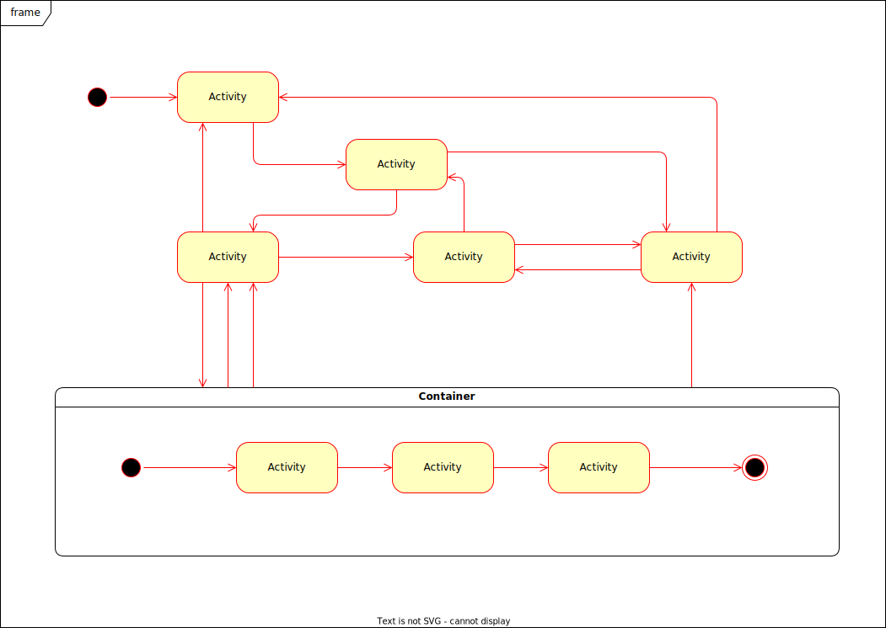

# use cases
## main system
This is the main system.

## Subsystem
this is the sub system 1

# User authentication

## Use Case: Login
**Input**: user enter their credentials.
**Output**: The system logs in the user.

1. User enter credentials.
2. System authenticate the user.
3. System successfully logs the user in and user is provided a message.

**Extention**
2a. system fails to authenticate the user.
  1. system promps error message that user credentials are incorrect.
  1. user re-enter credentials.
  
## Use Case: register
**Input**: user enters registeration information.
**Output**: System register user.

 